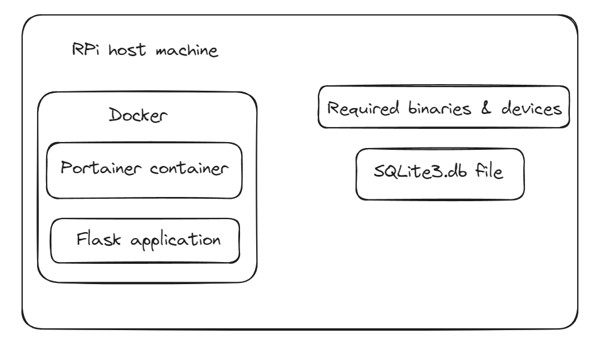

# CPU Stats Web Page (Project 1)
This project was done with portainer and docker in a Raspberry Pi, with the goal of being able to display various CPU statistics on a web page \
*As this is my first project, any information/code will be very prone to errors and misconfigurations.*

## Overview
In this project, the aim will be to set up a container in docker with the files in this github repo, allowing us to run a web app which displays CPU stats obtained from various commands 

## Procedure
1. Hook up app.py to docker container using `docker-compose.yaml` & `dockerfile` and map ports to RPi to allow access from clients on the same network
2. Set up front end for testing purposes
3. Set up stats fetching 
* You will need to import the necessary volumes and devices to be able to run `vcgencmd measure_temp`
    ```
    volumes:
      - /usr:/usr

    environment:
      - LD_LIBRARY_PATH=/usr/lib

    devices:
      - /dev/vchiq
      - /dev/vcio
    ```
4. Set up database to store and retrieve data 

## Project folder structure


## Topology


## Socket mappings
RPi: 192.168.100.153 \
Web page container: 172.19.0.2 

172.19.0.2:5000 -> 192.168.100.153:8081


## Dependencies
*As of last commit on this specific project:*
```
python:3.12-slim (docker image)
flask
docker 27.1.2
portainer community edition 2.19.4
```

## Important tip(s)/Useful information/References
1. Do not name your `WORKDIR` in `dockerfile` the same as your folders in your project repo: troubleshooting will be quit difficult
2. Specifying volume in docker compose is `src path`:`dst path`
2. On python's `subprocess`: 
    * [Shell = true or Shell = false?](https://stackoverflow.com/questions/3172470/actual-meaning-of-shell-true-in-subprocess)
    * [Running commands](https://martinheinz.dev/blog/98)
3. Sqlite3 set up:
    * [Sqlite3 set up for RPi](https://pimylifeup.com/raspberry-pi-sqlite/)
    * [How to use flask with Sqlite3](https://www.digitalocean.com/community/tutorials/how-to-make-a-web-application-using-flask-in-python-3)
4. Inspiration:
    * [Similar project using Redis](https://github.com/tomnewport/rpi-docker-cpu-temperature-server)